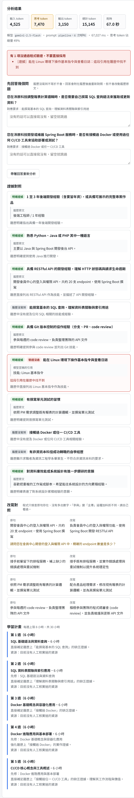

# Day 13｜把建議變成可操作的介面：證據卡片、改寫對照與學習路線

> Recap: 昨天計畫排出來了，也知道程式檢查得了什麼、檢查不了什麼

Day 05 做的那一頁，到現在還是呼叫 `/analyze`，拿回一段 Markdown 直接顯示
這幾天做的對照、澄清、改寫、計畫，全部在 `/analyze/full` 回來的 JSON 裡，畫面上一個都看不到

今天把它們接上畫面
還是同一個 `index.html`，沒有 build step，也沒有換框架

## 畫面上要回答的問題

我先想使用者看到結果時，第一個會問什麼

- 哪些結論不能信？
- 你說我有這個能力，根據是哪一句？
- 改寫之後哪裡不一樣？能直接用嗎？
- 接下來每週要做什麼？

所以結果分成五塊，照這個順序排

1. 沒通過驗證的清單
2. 澄清問題
3. 證據對照
4. 改寫對照
5. 學習計畫

## 沒通過驗證的放最上面

Day 09 到 Day 12，每一層都有「模型填的」跟「程式驗的」
程式驗沒過的東西，如果只是在卡片裡標個紅字，使用者要自己一張一張找

所以前端先把三種問題收在一起，放在最上面

```javascript
function collectProblems(rep) {
  // 證據：判定有證據，但引用驗證沒過
  // 改寫：原句不在履歷裡，或多了原文沒有的數字
  // 計畫：validate() 回來的 violations
}
```

標題寫的是「不要直接採用」，不是「警告」
警告很容易被當成可以忽略的東西

## 證據卡片

每一條職缺要求一張卡片，上面是判定，下面是引用

引用上面多一行小字，寫這句話是從哪裡來的

| 標示 | 意思 |
| --- | --- |
| 履歷原文 | 程式在履歷裡找到這句 |
| 你的補充回答 | 程式在 Day 11 的回答裡找到這句 |
| 模型宣稱的引用 | 程式找不到，這是模型說的 |

第三種卡片整張會變紅
這個區分對我來說是整個畫面最重要的地方，同樣是一段引用，可信程度完全不一樣

## 改寫對照

左邊原句、右邊改寫，下面放 `ask_user` 的問題
驗證沒過的，下面加一行「不要直接用」

這一塊的標題旁邊，我直接寫了程式的極限

> 程式只檢查原句存在、沒有多出數字。「參與」變「主導」這種加料抓不到，請自己看過。

Day 10 發現的問題還沒解決，畫面上就要老實講
不然使用者看到沒有紅字，會以為這些改寫都檢查過了

## 學習計畫跟資源

計畫照週分組，每一項寫時數、先修、理由
資源的部分，前端另外打 `GET /resources` 拿人工核實過的清單，用 id 對回計畫

```python
@app.get("/resources")
def list_resources() -> list[dict]:
    """只回人工核實過的資源，前端用 id 對回計畫裡的 resource_ids。"""
    return [r.model_dump() for r in resources.verified_only()]
```

目前清單裡一筆核實過的都沒有，所以每一項下面都寫「目前沒有人工核實過的資源」
這是刻意的，不串搜尋引擎，也不讓模型自己給網址

## 第一版的樣子



一年後端對初階職缺，67 秒、6 次模型呼叫、15,145 tokens，思考 token 佔了一半

最上面抓到一條：Linux 那條引用的是「技能: Linux 基本指令」，履歷裡沒有這句，Day 11 遇過的同一個問題
那張卡片整張是紅的，標著「模型宣稱的引用」

## 做出來才發現的問題

截圖仔細看，上面在問

> 您在沛原科技調整報表計算邏輯時，是否需要自己撰寫 SQL 查詢語法來獲取或更新資料？

下面的學習計畫，第 1、2 週已經排好了 SQL 基礎語法、資料表關聯與索引

問了，但沒有在等答案

在 API 裡看 JSON 的時候完全沒注意到，因為問題跟計畫是兩個不相干的欄位
放在同一個畫面上，矛盾一下就出來了

改法是還有問題沒回答，就先不排計畫

```python
# 還有問題沒回答，就先不排計畫
if do_plan and report.matching and not report.questions:
```

使用者回答完按「帶著回答重新分析」，第二輪才排計畫
順便省了一次模型呼叫

## 卡住的地方：403

改完想重跑一次，截一張回答完之後的畫面，結果左邊跳出

```text
錯誤 502
模型拒絕了這個請求（403）
```

第一個反應是權限，但同一個專案剛剛還跑得好好的
用最簡單的 `generate_content("ping")` 試，過了
回到網頁再按一次，又是 403

最後在終端機直接跑同一個流程，把例外的原因印出來才看到

```text
403 PERMISSION_DENIED. Spend cap breached for project: projects/(略) for service: aiplatform.googleapis.com
```

花費上限到了
今天為了寫 Day 11 到 Day 14，前前後後跑了好幾次完整流程，一次就是 4 到 6 次模型呼叫，還有 agent 的對話

Day 04 設的 $10 強制上限真的擋下來了，這是好消息
壞消息是畫面上只看得到「模型拒絕了這個請求（403）」，完全看不出來是錢的問題

`llm.py` 把 403 一律包成同一句話，原因被吃掉了
使用者不會知道是等一下就好、還是永遠不會好，這個留到 Day 24 處理重試跟錯誤分類的時候一起改

所以回答完之後的那張截圖，今天拍不到

版本：fastapi 0.141.1、google-genai 2.22.0、gemini-2.5-flash

## 明天

到今天為止，全部都是固定流程：解析、對照、澄清、改寫、計畫，順序寫死
今天也看到了它的極限：只能問一輪、驗證沒過也只能顯示出來，不會自己回頭改

明天開始第四章，看看什麼時候才真的需要 Agent

---

<!-- 發文前檢查
- [ ] 內文 300 字以上，且切題
- [ ] 履歷資料全部虛構，沒有用到任何真實履歷（含自己的）
- [ ] 程式碼片段可執行，並標示套件版本
- [ ] 截圖已去識別化，沒有露出 project id / 帳號 / 金鑰
- [ ] 截圖上傳到 iThome 後，把 ./day13-result-v1.png 換成上傳後的網址
- [ ] 花費上限解除後，補一張回答完問題的第二輪截圖
- [ ] 有連回前一天、預告下一天
-->
